# ナイーブベイズ分類器
## 今回考える問題
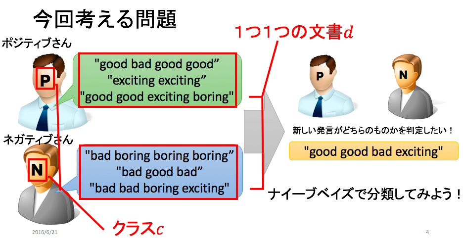

## ナイーブベイズ分類器
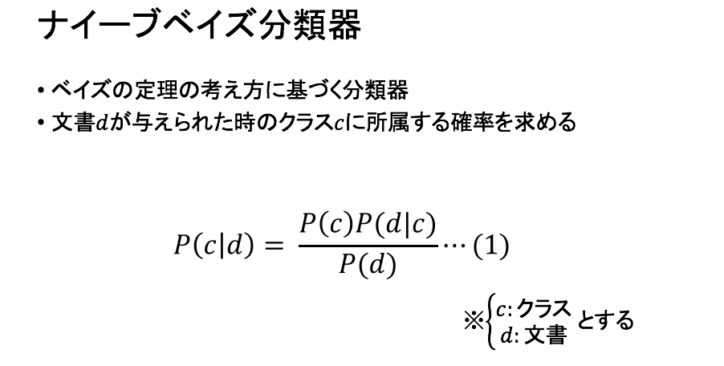

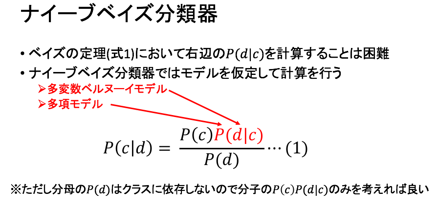

## 多変数ベルヌーイモデル
### 多変数ベルヌーイモデルの適用

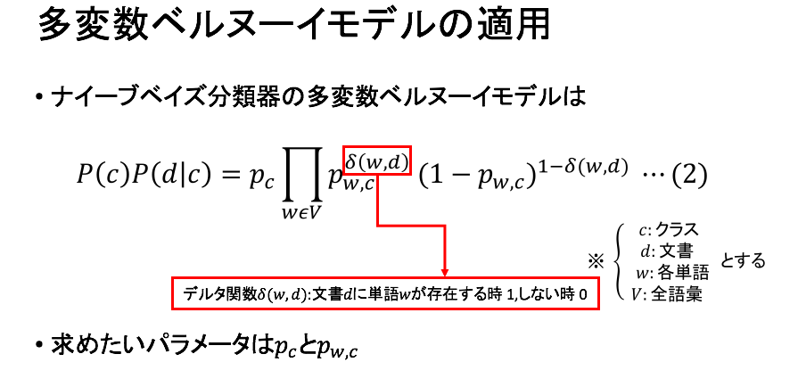

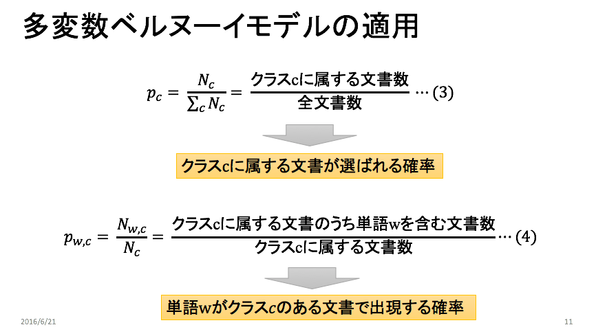

### 多変数ベルヌーイモデル***学習フェーズ***
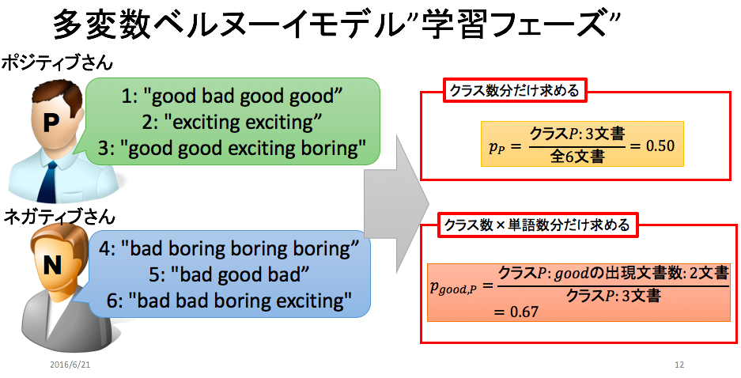

### 多変数ベルヌーイモデル***分類フェーズ***
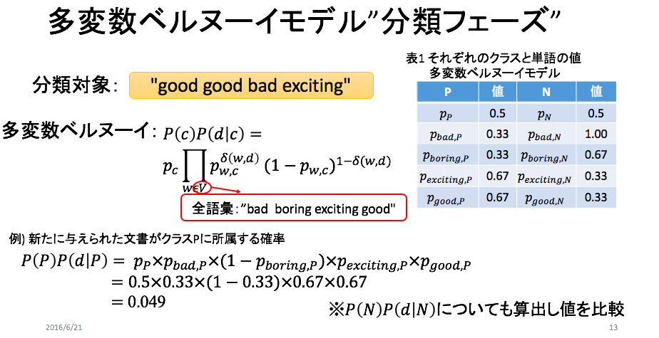

### 実装ナイーブベイズ***学習フェーズ***
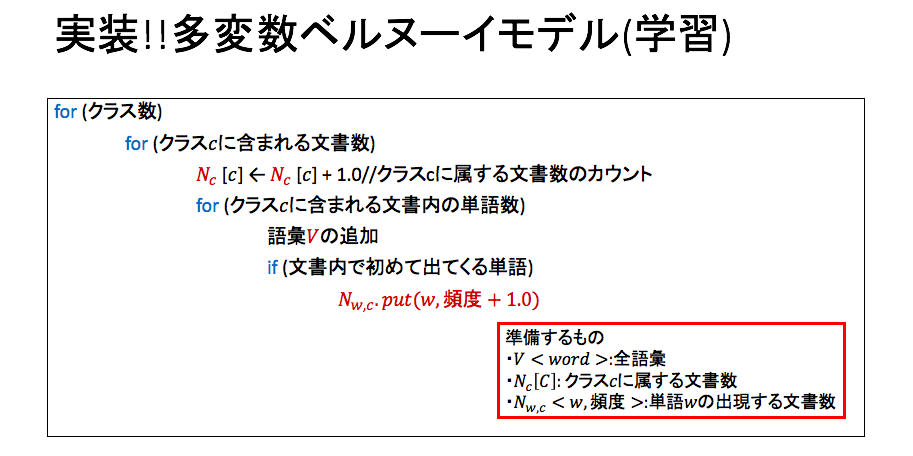

### 実装ナイーブベイズ***分類フェーズ***
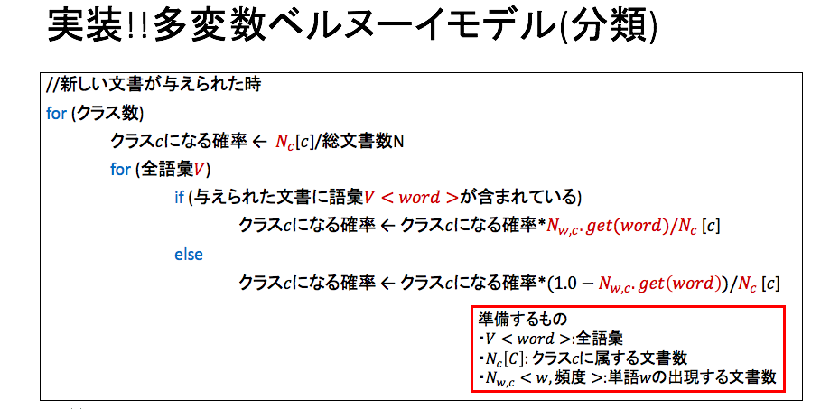

## 多項モデル
### 多項モデルの適用
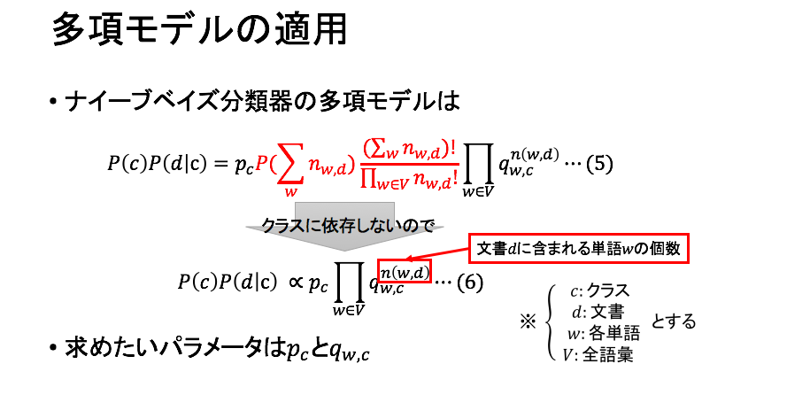

### 多項モデル***学習フェーズ***
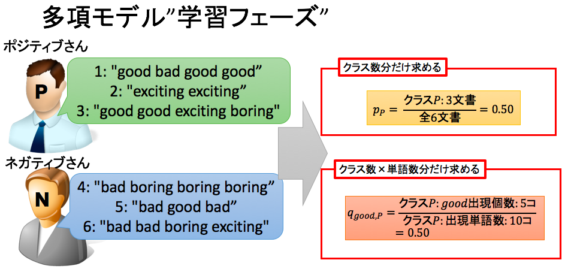

### 多項モデル***分類フェーズ***
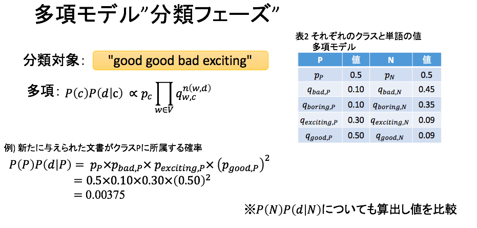

### 実装ナイーブベイズ***学習フェーズ***
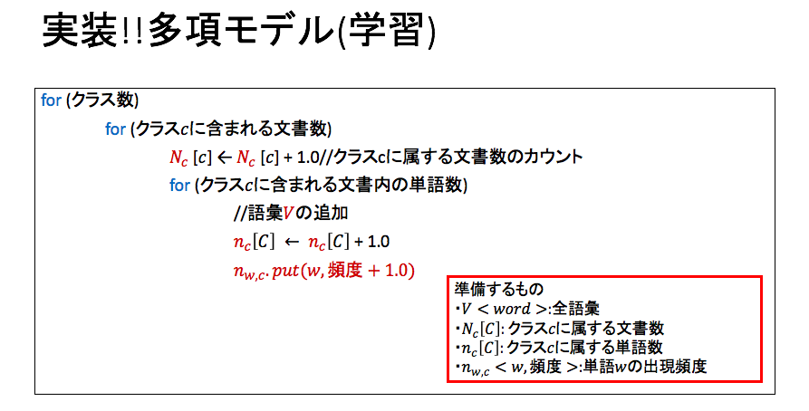

### 実装ナイーブベイズ***分類フェーズ***
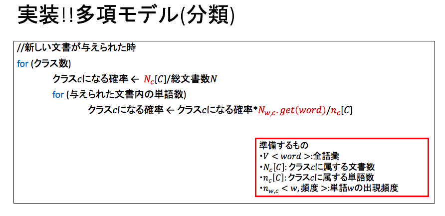
